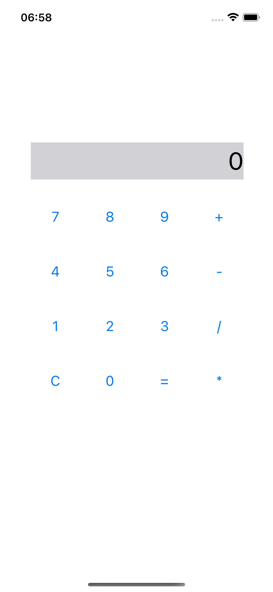
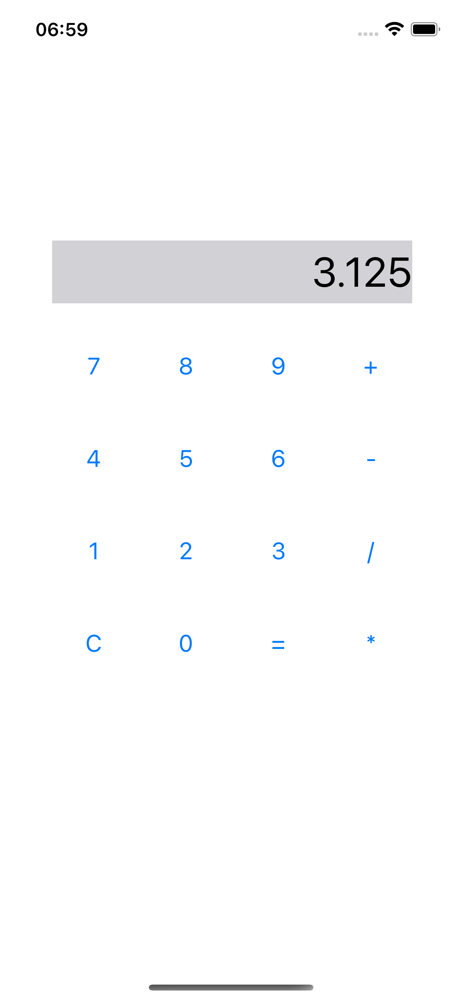

CalculatorApp

Простое приложение-калькулятор для iOS, написанное на Swift с использованием UIKit.

Описание

Это классический калькулятор, который поддерживает базовые арифметические операции:
	•	Сложение (+)
	•	Вычитание (-)
	•	Умножение (*)
	•	Деление (/)
	•	Очистка данных (C)

Результат отображается на экране после ввода выражения и нажатия кнопки “=”.
Также реализована защита от деления на ноль.

Технологии

	•	Swift
	•	UIKit
	•	Xcode

Возможности

	•	Работа с числами типа Double
	•	Проверка корректности ввода
	•	Очистка данных кнопкой C
	•	Обработка деления на 0
	•	Отображение целых чисел без лишних знаков после запятой

Скриншоты

Установка

	1.	Склонируйте репозиторий:

git clone https://github.com/DanilaRuzh/CalculatorApp.git

	2.	Откройте проект в Xcode
	3.	Запустите на симуляторе или устройстве

Контакты

Автор: DanilaRuzh
GitHub: https://github.com/DanilaRuzh
